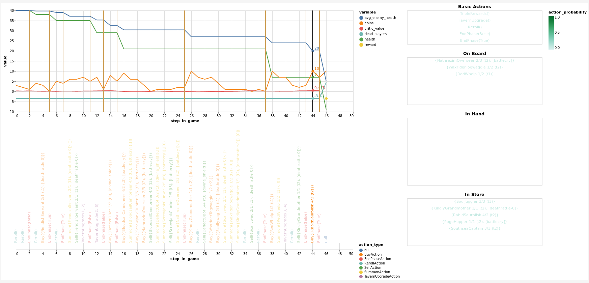

## Stone Ground Hearth Battles

Hearthstone battlegrounds simulator is licensed under the Apache 2.0 License

This repository includes a simulator along with bots and allows the user to play against the bots. There are various
attempts to use Pytorch to train a bot.

### Tensorboard Plugin

This repo also contains a Tensorboard plugin for displaying vega/vega-lite/altair plots in tensorboard. We use this to
plot debug information about our pytorch bots, but this plugin works standalone.



To use it, run

`$ python setup.py develop`

from within the `tensorboard_vega_embed/` directory. When you launch tensorboard, it will show up as a new tab labeled "
VEGA_EMBEDX". To uninstall it, run `$ python setup.py develop --uninstall`.

### Distributed Training Environment

This repo also contains a distributed training setup to play several games in parallel using a single GPU, using Pytorch
Distributed and python asyncio.


### Benchmarks

Speed of simulation can be important for Reinforcement Learning. Woe is upon us for choosing to write the simulator in
python, thinking that it would not be the bottleneck. CPU is the bottleneck for experience generation, not GPU :(

Therefore, we have benchmarks to profile the performance of our simulator, and identify bottlenecks. To run one of the
profiles, run, e.g.

```shell
$ PYTHONPATH=. python -m cProfile benchmarks/benchmark_simulation.py -o benchmarks/profiles/simulation.cprof
```